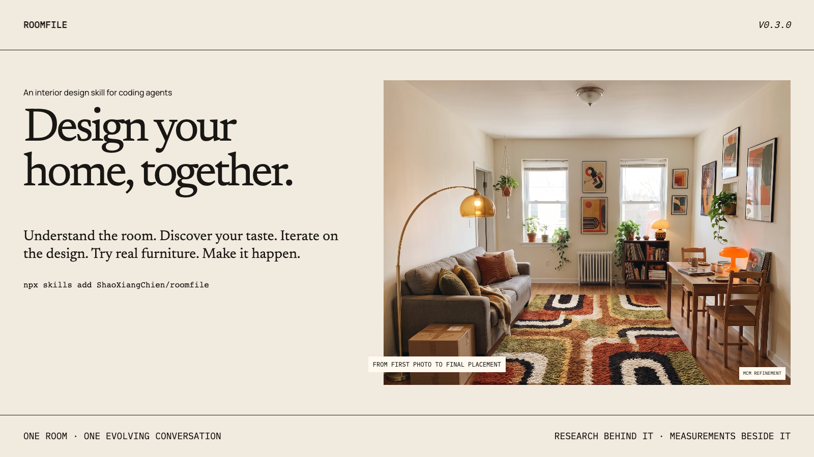

# Roomfile

## Design your home, together.

Roomfile is an open-source interior design skill for coding agents. It helps
your AI understand the space you have, discover what you love, iterate on the
design with you, try real furniture, and turn the final idea into a room you
can actually create.



```bash
npx skills add ShaoXiangChien/roomfile
```

[See a room take shape](https://roomfile-shaoxiangchien.ericchien21.chatgpt.site/examples/apartment)

## One continuous design project

Roomfile gives an agent a repeatable way to work with you through the whole
decorating process:

1. **Meet the room** — understand its photos, layout, existing furniture, daily
   use, and anything that cannot change.
2. **Find what feels like you** — turn links, screenshots, products, likes, and
   dislikes into specific taste evidence without forcing a style label.
3. **Design it together** — explore and refine ideas while keeping earlier
   decisions and the room itself intact.
4. **Try the real thing** — place furniture you find, compare it with the
   design, and check its measured footprint separately from the image.
5. **Make it real** — research purchasable pieces, compare sources, manage the
   budget, and build a phased plan for the room.

Calling `$roomfile` without a command resumes with `$roomfile status`.

## Quick start

```text
$roomfile init
$roomfile style MCM
$roomfile taste
$roomfile capture living-room
$roomfile brief
$roomfile explore
$roomfile refine
$roomfile place
$roomfile source
$roomfile plan
$roomfile audit
```

During `init`, Roomfile asks where you live, which currency and measurement
units you use, your budget, and where you prefer to shop. If you have no
preferred retailers, you can ask the agent to suggest locally available
sources. These answers guide sourcing later instead of applying a global store
list.

## Style Atlas

Roomfile includes research-led field guides for
[Mid-century Modern](https://roomfile-shaoxiangchien.ericchien21.chatgpt.site/styles/mid-century-modern),
[Bauhaus](https://roomfile-shaoxiangchien.ericchien21.chatgpt.site/styles/bauhaus),
and
[Japandi](https://roomfile-shaoxiangchien.ericchien21.chatgpt.site/styles/japandi).
They are the first deep research packs, not a list of supported styles or a
style picker.

```text
$roomfile style MCM
$roomfile style "Compare Bauhaus and Japandi spatial logic"
```

Each pack combines a quick guide, a cited field guide, structured design
signals, 25–40 sources, and 12–18 locally bundled visual records with reusable
image licenses and complete attribution. Roomfile uses progressive loading:
it reads the small index first, then the relevant quick guide and signals, and
opens the full field guide or image records only for deeper questions. This
keeps routine room work focused while preserving a researched path when needed.

Roomfile uses the research to ask sharper
questions; your inspiration, reactions, room facts, and overrides remain the
source of truth. Unknown styles and under-covered variants trigger sourced
live research instead of a guessed match.

The skill Atlas is authoritative. The public
[Roomfile Style Atlas](https://roomfile-shaoxiangchien.ericchien21.chatgpt.site/styles)
is generated from the same records.

### Controlled benchmark

The [same-room Style Atlas benchmark](examples/style-atlas-benchmark/README.md)
compares three baseline prompts with three Atlas-guided prompts while holding
the fictional room, camera, locked architecture, retained furniture, and
resident evidence constant. It records prompts, costs, provider metadata,
human review, and failure modes. One stochastic sample is not treated as proof
of objective superiority.

## Selected homes

The public examples show three different projects rather than a catalog of
style presets:

- a warm, collected **Mid-century Modern living room**;
- a compact **Bauhaus workspace** designed around focus and reversible storage;
- a quiet **Japandi bedroom** designed around rest and low visual weight.

The living-room story includes a scaled plan, iterative renders, a product
placement test, and a researched ledger with pieces available from sources
including IKEA and Amazon. Example prices and availability are dated evidence,
not permanent claims.

## Images suggest. Measurements decide.

Every generated room image is a:

> Visual approximation — verify dimensions, color, material, and availability
> before purchasing.

Only structured measurements and the dependency-free fit checker may report
physical fit. It checks boundaries, overlap, door swings, clearances, and
circulation.

```bash
node skills/roomfile/scripts/check-fit.mjs \
  --geometry examples/us-apartment/roomfile/rooms/living-room/geometry.json \
  --products examples/us-apartment/roomfile/rooms/living-room/products.json \
  --json
```

## Project format

Private initialization creates a gitignored `roomfile/` folder:

```text
roomfile/
├── roomfile.json
├── HOME.md
├── STYLE.md
├── INVENTORY.md
├── inspiration/
├── rooms/<slug>/
│   ├── geometry.json
│   ├── facts.json
│   ├── products.json
│   ├── concepts/
│   └── EXECUTION.md
└── .runtime/
```

Personal photos, postal codes, budgets, and provider state remain in the local
project. Private projects are gitignored by default. Roomfile asks before
sending private images to a new external renderer.

## Compatibility

| Environment | Status |
| --- | --- |
| Codex | officially tested |
| Agent Skills-compatible coding agents | best-effort |
| Banana / Gemini image models | preferred, optional |
| Other image providers | provider-neutral fallback |
| Node.js | 20+ |

Roomfile v0.3.0 adds the Hybrid Style Atlas and a project-level style context
while preserving the preference-first profile and three-letter ISO currencies.
Existing v0.1.0 and v0.2.0 projects can be validated and migrated:

```bash
node skills/roomfile/scripts/migrate-project.mjs \
  --project /absolute/path/to/roomfile \
  --to 0.3.0 \
  --json
```

## Development

```bash
npm test
npm run test:skill
npm run validate:example
npm run check:privacy
npm run validate:atlas
npm run validate:benchmark
npm run sync:styles:check
npm run test:website
npm --prefix website run test:e2e
```

See [CONTRIBUTING.md](CONTRIBUTING.md) for the release workflow. New field
guides follow the [Style Atlas research and image-license checklist](skills/roomfile/references/style-atlas/CONTRIBUTING.md).

## License

Copyright 2026 Roomfile contributors.

Licensed under [Apache-2.0](LICENSE).
